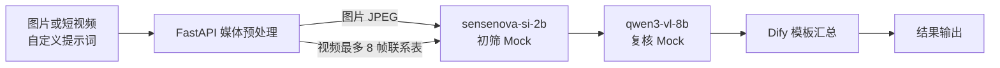

# 架构说明

## 目标

将图片和短视频转换为 JPEG，提供初筛与复核两种角色的工作流示例。公开实现包含媒体服务和两个 Mock；Dify 编排只完成 YAML 静态契约检查，尚未验证视觉文件传递或端到端运行。

## 组件

| 组件 | 公开 Demo | 设计用途 |
| --- | --- | --- |
| 工作流编排 | 目标为 Dify 1.17.x 的 Workflow DSL | 接收媒体、提示词和输出格式，串联各节点；待实机验证 |
| 媒体处理 | FastAPI + Pillow + FFmpeg | 图片规范化，按时间采样最多 8 个实际视频帧并生成联系表 |
| 初筛接口 | OpenAI 风格 Mock，别名 `sensenova-si-2b` | 返回初筛角色的示例文本 |
| 复核接口 | OpenAI 风格 Mock，别名 `qwen3-vl-8b` | 返回复核角色的示例文本 |
| 结果汇总 | Dify Template Transform | 输出详细对比、精简结论或原始结果 |

## 架构图

以下为 DSL 预期路径，不代表已完成 Dify 运行验证。别名不证明真实模型型号、授权或实际部署。

## DSL 设计的请求路径

1. 用户上传一个图片或视频，并填写自定义提示词；
2. Dify 将文件提交给媒体预处理服务；
3. 图片转为 RGB JPEG；视频在首末可解码帧之间按时间均匀布点，选择最近帧并去重，生成最多 8 帧的联系表；
4. 初筛节点的提示词要求输出观察对象、风险、依据和待复核疑点；
5. 复核节点配置了同一视觉输入，并通过提示词要求重新检查后对照初筛文本；
6. Dify 模板汇总两个节点的文本并返回结果。

公开 Mock 只提取文本字段，不读取视觉内容；上述节点配置和提示词不能证明视觉输入实际到达或模型进行了独立复核。当前 DSL 没有独立 IF-ELSE 节点，模板中的条件只用于格式化输出。

## 设计取舍

- 联系表将视频转换为单个标准图片输入，降低工作流和模型服务之间的格式耦合；
- 视频按真实帧时间戳选帧，并列时取较早帧；实际帧数可少于请求值，标签表示相对首帧的时间，避免将容器尾部的无帧区间当作可抽取位置；
- 初筛与复核职责分离是设计意图，真实模型是否重新查看视觉证据需要单独验收；
- Demo 用 Mock 测试验证请求结构和 JSON/SSE 响应；真实模型型号、协议、授权和端点需单独核验；
- 输入文件只来自上传内容，服务不执行用户传入的命令，也不代替用户访问任意 URL。
